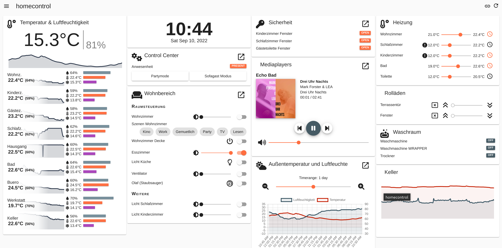

# homecontrol dashboard
Provides a configurable dashboard to control your homie devices

[](https://homieiot.github.io/)


__`hc-dashboard` is part of:__

[](https://github.com/homie-homecontrol) <span style="font-size:32px; font-weight: 700;">homie-homecontrol</span>  &nbsp;[link](https://github.com/homie-homecontrol)

# Screenshot




# Docker image
```
docker pull ghcr.io/homie-homecontrol/hc-dashboard:latest
```
See below for a usage example with docker compose.

# Configuration - Environment variables

## MQTT Broker config

`HCDASH_MQTT_URL`

* the connection address of the mqtt broker. This can be a `mqtt://` protocol address or `ws://` | `wss://` address depending on you scenario. If no port is specified defaults will be assumed. (mqtt: 1883, ws: 80, wss: 443)

`HCDASH_MQTT_USERNAME`

* Username for the MQTT connection. If the MQTT broker is unsecured this can be left empty.

`HCDASH_MQTT_PASSWORD`

* Password for the MQTT connection. If the MQTT broker is unsecured this can be left empty.

`HCDASH_MQTT_TOPIC_ROOT`

* MQTT topic under which all homie devices are published. By convention this defaults to `homie`, however for your testing or developing reasons this can be changed here as not to disturb productive usage.


## Server config

`HCDASH_HOST`

* hostname to listen on (defaults to 0.0.0.0)

`HCDASH_PORT`

* port to listen on (defaults to 8443)


## Configuration storage config

`HCDASH_CONFIG_BACKEND`

* file | kubernetes

`HCDASH_CONFIG_FOLDER`

* path to config folder


## Influxdb connection config (for graphs)

`HCDASH_INFLUX_URL`

* url

`HCDASH_INFLUX_TOKEN`

* token

`HCDASH_INFLUX_ORG`

* org

`HCDASH_INFLUX_BUCKET`

* bucket

# Dashboard Configuration

TODO: document everything!
... until then, check the examples folder. Every possible widget and combination is somehow listed in there... sry..


# Example docker-compose config

You can use the ready made example in the `example` folder.
* clone this repo
* `cd hc-dashboard/examples`
* adjust your InfluxDB connection info (or remove it) in the file `docker-compose.yaml`
* `docker-compose up`

```yaml
services:
    mqtt:
        image: eclipse-mosquitto:latest
        restart: "always"
        deploy:
            resources:
                limits:
                    memory: 125M
        hostname: mqtt
        ports: 
            - "1883:1883"
        volumes:
            - ./mqtt/config/mosquitto.conf:/mosquitto/config/mosquitto.conf
            - ./mqtt/data:/mosquitto/data
            - ./mqtt/log:/mosquitto/log
    hc-dashboard:
        image: ghcr.io/homie-homecontrol/hc-dashboard:latest
        restart: "always"
        depends_on:
            - mqtt
        dns:
            - 8.8.8.8
        ports: 
            - "80:8443"
        deploy:
            resources:
                limits:
                    memory: 525M
        environment: 
            HCDASH_HOST: 0.0.0.0
            HCDASH_PORT: 8443
            HCDASH_MQTT_URL: "mqtt://mqtt"
            HCDASH_MQTT_TOPIC_ROOT: homie-dev
            HCDASH_CONFIG_FOLDER: ./data
            HCDASH_INFLUX_URL: "<INFLUXDB URL>"
            HCDASH_INFLUX_TOKEN: "<INFLUXDB Token>"
            HCDASH_INFLUX_ORG: "<INFLUXDB org>"
            HCDASH_INFLUX_BUCKET: "<INFLUXDB Bucket>"
            TZ: "Europe/Berlin"
        volumes:
            - ./hc-dash-config:/backend/data
            - /etc/timezone:/etc/timezone:ro
            - /usr/share/zoneinfo/Europe/Berlin:/etc/localtime:ro


```